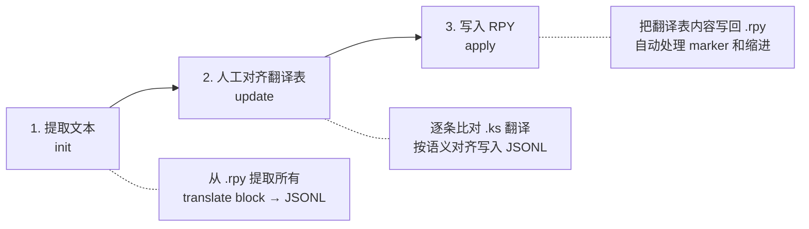

# 漏夏 Revival 中文翻译项目

> 将旧版 Kirikiri (吉里吉里) 引擎的 `.ks` 剧本翻译整合到新版 Ren'Py 的 `.rpy` 文件中。

## 项目概要

旧版游戏（2017年）的 `.ks` 剧本文件中包含中文翻译，新版 Ren'Py 引擎（2019年）中 `.rpy` 文件的翻译均为空。
本项目的工作是：比对旧版 KS 翻译内容，将其对齐并填入新版 RPY 的空翻译 block 中。

### 翻译流程



### 核心规则

1. **优先使用旧版翻译**：所有翻译以 `extract/` 下 `.ks` 文件为准
2. **逐条人工比对**：KS 与 RPY 是多对多关系，不可按行号偏移自动匹配，必须逐条按语义对齐
3. **新增内容标记**：旧版中不存在的台词，使用机翻或人工翻译，标记类型为 `机翻` 或 `人工`
4. **翻译来源注释**：每条翻译上方自动插入注释，格式 `# [旧版翻译] 来源: 3日目.ks (KS 18-19)`
5. **占位符替换**：`[漏れ]`→`我`，`[博行]`→`博行`，`[西村]`→`西村`，`[咱]`→`我`；Ren'Py 变量如 `[fn]`、`[ln]` 在翻译中硬编码为对应名字

### 格式转换规则

| KS 标签 | RPY 标签 | 说明 |
|---------|----------|------|
| `[l]` | `{p}` | 段落停顿 |
| `[wdt]` | `{w=.3}` | 短暂等待 |
| `【角色】「…」` | `spk "「…」"` | 对话用「」，去掉【】 |
| 旁白文本 | `"文本"` | 纯文本，不用引号 |
| `[漏れ]`/`[咱]` | `我` | 第一人称 |
| `[博行]` | `博行` | 主人公名 |
| `[西村]` | `西村` | 主人公姓 |

### KS 文件优先级

同一天数的 `.ks` 文件可能同时存在于 `extract/orig/` 和 `extract/torahiko/`。
当两者文件名相同时，**`extract/torahiko/` 优先**（该目录包含完整翻译版本）。

## 快速开始

```bash
# 环境设置
uv sync
source .venv/bin/activate

# 查看翻译进度
python scripts/translate.py status

# 从 RPY 文件初始化翻译表（仅首次或翻译表丢失时）
python scripts/translate.py init

# 提取旧版 KS 文本（用于比对参考）
python scripts/extract_texts.py --mode ks --ks-dirs extract/orig extract/torahiko
```

## 翻译管理脚本 `translate.py`

所有翻译操作通过 `translate.py` 的子命令完成。

### `init` — 从 RPY 文件初始化翻译表

从所有 `rpy/` 目录下的 `.rpy` 文件中提取 `translate` block，生成 `translation_table.jsonl`。
已有条目不会被覆盖，可安全重复运行。

```bash
python scripts/translate.py init
```

### `status` — 查看翻译进度

```bash
python scripts/translate.py status
```

### `export-untranslated` — 导出未翻译条目

```bash
# 导出指定路线
python scripts/translate.py export-untranslated --prefix candy03

# 导出指定文件
python scripts/translate.py export-untranslated --file "day 3.rpy"
```

### `update` — 更新翻译表

**单条更新**：
```bash
python scripts/translate.py update \
    --block-id torahiko03_57e52401 \
    --translation "你好" --type "旧版翻译" \
    --source "3日目.ks" --ks-lines "18-19"
```

**批量更新**（JSONL 格式）：
```bash
# 每行一个 JSON 对象：{"id":"xxx","translation":"xxx"}
python scripts/translate.py update --batch updates.jsonl --type 旧版翻译
```

### `apply` — 将翻译写回 RPY 文件

```bash
# 预览修改（不写入文件）
python scripts/translate.py apply --dry-run

# 写入指定文件
python scripts/translate.py apply --file "day 3.rpy"

# 写入指定天数及之后的文件
python scripts/translate.py apply --start-day 3

# 写入所有文件
python scripts/translate.py apply
```

`apply` 会自动处理：
- 插入 `# [旧版翻译] 来源: 文件名 (KS 行号)` 注释
- 正确保留 narration（4空格+引号）和 speaker（4空格+发言者+引号）的缩进
- 翻译中的换行符自动转义为 `\n`（Ren'Py 要求字符串在单行内）
- 跳过 `translate chinese_simplified strings:` 块（`old`/`new` 格式）
- 覆盖已有的旧翻译（如有标记则更新）

### `embed` — 计算文本向量嵌入（可选）

```bash
python scripts/translate.py embed --model paraphrase-multilingual:278m
python scripts/translate.py embed --model paraphrase-multilingual:278m --file "day 3.rpy"
```

## 翻译表格式

`translation_table.jsonl` 每行一个 JSON 对象，按 `rpy_file` + `source_line` 排序。

```json
{
  "id": "torahiko03_57e52401",
  "rpy_file": "day 3.rpy",
  "source_line": 99,
  "speaker": "gm",
  "source": "「Hello. This is [ln] speaking...」",
  "translation": "「你好，这里是西村家。」",
  "translation_type": "旧版翻译",
  "translation_source": "3日目.ks",
  "ks_lines": "18-19",
  "embedding": null
}
```

| 字段 | 说明 |
|------|------|
| `id` | translate block ID（唯一键，基于哈希） |
| `rpy_file` | 源 RPY 文件名 |
| `source_line` | RPY 文件中对应的行号 |
| `speaker` | 发言者前缀（`fn`/`gm`/`ka` 等），空字符串表示旁白 |
| `source` | 英文原文 |
| `translation` | 中文翻译，空字符串表示未翻译 |
| `translation_type` | `"旧版翻译"` / `"机翻"` / `"人工"` / `""` |
| `translation_source` | 来源文件或模型（如 `"3日目.ks"`、`"gpt-4o"`） |
| `ks_lines` | 旧版 KS 源文件中的行号范围（如 `"18-19"`） |
| `embedding` | 文本向量，`null` 表示未计算 |

## 文件结构

```
├── rpy/                          # Ren'Py 翻译文件（目标）
├── extract/
│   ├── orig/                     # 旧版 KS 中文翻译（源）
│   └── torahiko/                 # 虎彦路线完整翻译（同文件名时优先）
├── scripts/
│   ├── translate.py              # 翻译管理核心脚本
│   └── extract_texts.py          # 文本提取（KS/RPY）
├── output/                       # 批量更新 JSONL 文件
└── translation_table.jsonl       # 翻译表（核心数据）
```

## Speaker 映射

| RPY 前缀 | 日文名 | 角色 |
|----------|--------|------|
| `fn` | 博行 | 主人公 |
| `gm` | 奶奶 | 奶奶 |
| `ka` | 洸哉 | 洸哉 |
| `ky` | 京慈 | 京慈 |
| `to` | 虎彦 | 虎彦 |
| `ta` | 辰樹 | 辰樹 |
| `si` | 深 | 深 |
| `su` | 峻 | 峻 |
| `ko` | 孝之助 | 孝之助 |
| `cl` | 店員 | 店员 |
| `ju` | 柔一 | 柔一 |
| `so` | 宗太郎 | 宗太郎 |
| `yk` | 幸春 | 幸春（孝之助之弟） |
| `harue` | 春恵 | 春恵（孝之助之母） |
| `boy` | 七伏 | 七伏（谜之少年） |
| `who` | — | 未确认身份的发言者 |
| `brothers` | — | 兄弟齐声 |

## Day 7 路线对应

| RPY 前缀 | KS 源文件 | 场景概要 |
|----------|-----------|----------|
| `day07` | `extract/orig/7日目.ks` | 夜间电话序幕 |
| `beach07_invite_torahiko` | `extract/orig/7日目.ks` | 虎彦电话邀请（共用孝之助模板） |
| `beach07_invite_tatsuki` | `extract/orig/7日目.ks` | 辰兄电话邀请 |
| `beach07_invite_kounosuke` | `extract/orig/7日目.ks` | 孝之助电话邀请 |
| `beach07_invite_shun` | `extract/orig/7日目.ks` | 峻电话邀请 |
| `beach07_invite_kouya` | `extract/orig/7日目.ks` | 洸哉电话邀请 |
| `beach07_invite_juuichi` | `extract/orig/7日目.ks` | 柔一电话邀请 |
| `beach07_invite_shin` | `extract/orig/7日目.ks` | 深电话邀请 |
| `beach07_invite_soutarou` | `extract/orig/7日目.ks`（日文原文） | 宗太郎电话邀请（KS为日文，机翻） |
| `beach07_packing` | `extract/orig/7日目.ks` | 收拾行李+次日早起 |
| `beach07_meetup` | `extract/orig/c_海水浴.ks` | 巴士站集合+巴士车程+抵达海滩 |
| `beach07_hangloose` | `extract/orig/c_海水浴.ks` | 峻换衣场景A（提醒穿运动内衣） |
| `beach07_buckleup` | `extract/orig/c_海水浴.ks` | 峻换衣场景B（未提醒） |
| `beach07_kounosuke` | `extract/orig/c_海水浴.ks` | 孝之助海滩路线 |
| `beach07_kyoutarou` | `extract/orig/c_海水浴.ks` | 京慈海滩路线（与辰樹搭档） |
| `beach07_juuichi` | `extract/orig/c_海水浴.ks` | 柔一海滩路线（劈西瓜+游泳+情感对话） |
| `beach07_torahiko` | `extract/torahiko/7日目.ks` | 虎彦海滩路线（冲浪教学） |
| `beach07_kouya` | `extract/orig/c_海水浴.ks` | 洸哉海滩路线 |
| `beach07_shin` | `extract/orig/c_海水浴.ks` | 深海滩路线 |
| `beach07_tatsuki` | `extract/orig/c_海水浴.ks` | 辰樹海滩路线 |
| `beach07_shun` | `extract/orig/c_海水浴.ks` | 峻海滩路线 |
| `beach07_ridehome` | `extract/orig/c_海水浴.ks` | 巴士归途（共通结尾，梦话场景） |

## Day 4 路线对应

| RPY 前缀 | KS 源文件 | 场景概要 |
|----------|-----------|----------|
| `day04` | `extract/orig/4日目.ks` | 电话/日常选择 |
| `torahiko04` | `extract/torahiko/4日目.ks` | 自行车看海 |
| `tatsuki04` | `extract/orig/辰樹_s_01.ks` | 醉龙（3分支: party/scold/help） |
| `shin04` | `extract/orig/深_m_02.ks` | 购物（2分支: commoner/familial） |
| `shun04` | `extract/orig/峻_s_05.ks` | 棒冰（2分支: biteshun/bitesou） |
| `kounosuke04` | `extract/orig/孝之助_m_02.ks` | 与幸春重逢 |
| `juuichi04` | `extract/orig/柔一_m_02.ks` | 萤火虫（含鬼故事分支+背送回家） |

## Day 5 路线对应

| RPY 前缀 | KS 源文件 | 场景概要 |
|----------|-----------|----------|
| `day05` | `extract/orig/5日目.ks` | 路由选择 |
| `kouya05` | `extract/orig/洸哉_s_02.ks` | 糖果店大战（3分支: cheese/salad/takoyaki） |
| `tatsuki05` | `extract/orig/辰樹_s_06.ks` | 购物/开车/得救（3分支: kaimono/unten/tasukaru） |
| `juuichi05` | `extract/orig/柔一_m_03.ks` | 萤火虫捕获 |

## Day 6 路线对应

| RPY 前缀 | KS 源文件 | 场景概要 |
|----------|-----------|----------|
| `day06` (base) | `extract/orig/6日目.ks` | 早晨 + 柔一电话（忘记萤火虫约定） |
| `day06` (test) | `extract/orig/孝之助_s_02.ks` | 试胆大会集合+规则+3条分组路线+结尾 |
| `kounosuke06` | `extract/orig/孝之助_s_02.ks` | 糖果店前孝之助邀请试胆 |
| `torahiko06` | `extract/torahiko/6日目.ks` | 虎彦料理日（购物/烹饪/海边通知） |

## 翻译进度

| 文件 | 已翻译 | 总数 | 状态 |
|------|--------|------|------|
| Day 4.rpy | 748 | 748 | **100%** |
| day 5.rpy | 454 | 454 | **100%** |
| day 6.rpy | 1002 | 1002 | **100%** |
| day 7.rpy | 1671 | 1671 | **100%** |
| Welcome Party.rpy | 1336 | 1380 | 96.8% |
| day 3.rpy | 419 | 422 | 99.3% |
| day 2.rpy | 864 | 1076 | 80.3% |
| Day 16.rpy | 6 | 2148 | 0.3% |
| 其他 25 个文件 | 0 | ~28500 | 待处理 |
| **合计** | **6500** | **34191** | **19.0%** |
